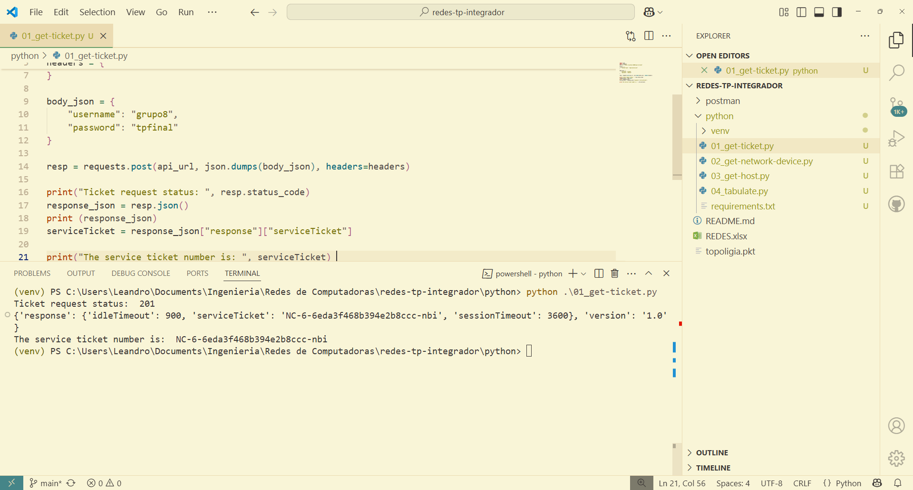
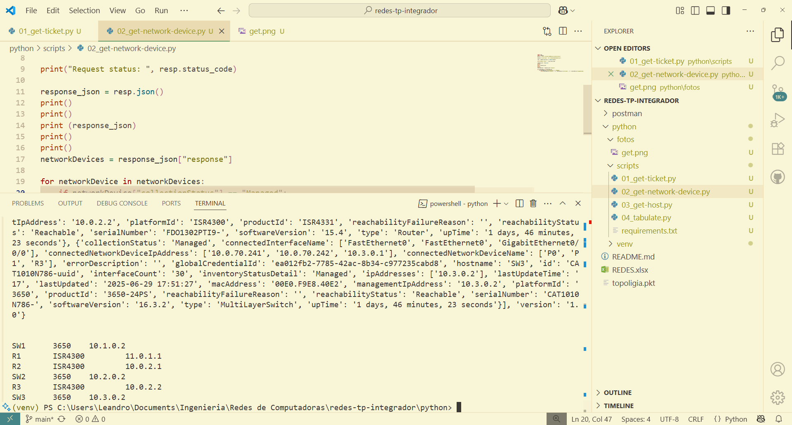
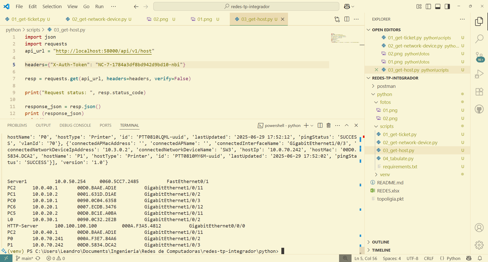
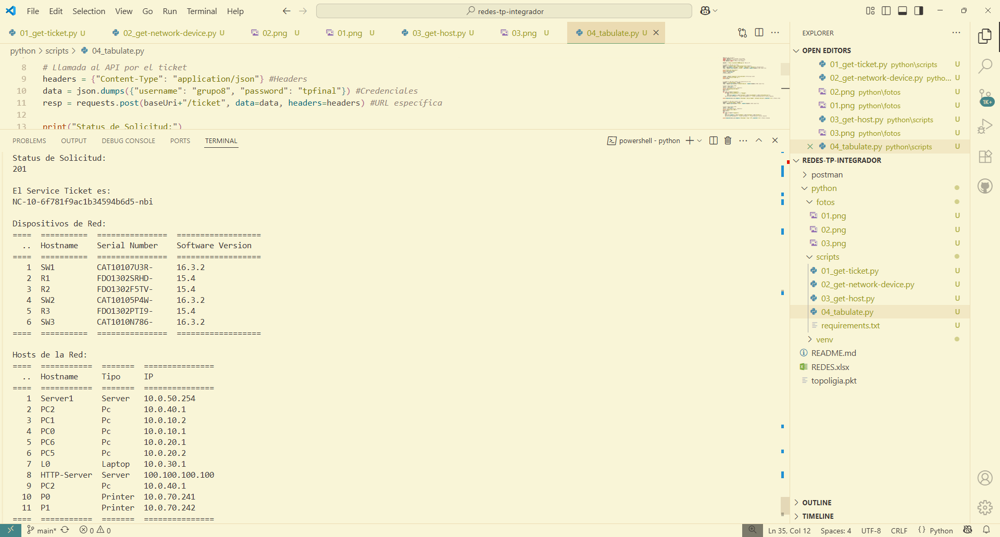

# Uso de API con Python

1. Crear y activar un entorno virtual
```Shell
python -m venv ./.venv
```

Windows
```Powershell
./.venv/Scripts/Activate.ps1
```

Unix
```bash
./.venv/Scripts/activate
```

2. Instalar dependencias
```Shell
pip install -r ./requirements.txt 
```

3. Correr scripts
```
python scripts/01_get-ticket.py
python scripts/02_get-network-device.py
python scripts/03_get-host.py
python scripts/04_tabulate.py
```

# Resultados

### GET Ticket



### GET Network



### GET Host


### Tabulate

